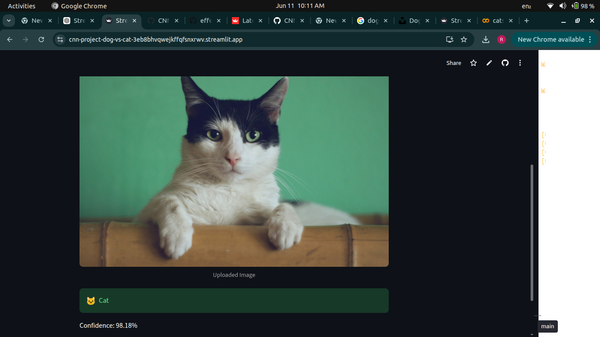
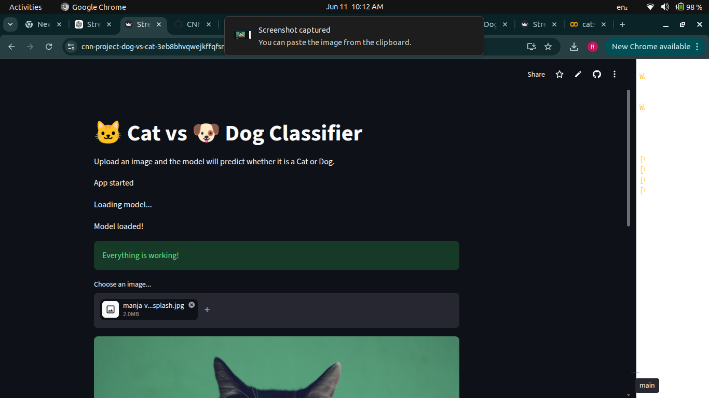
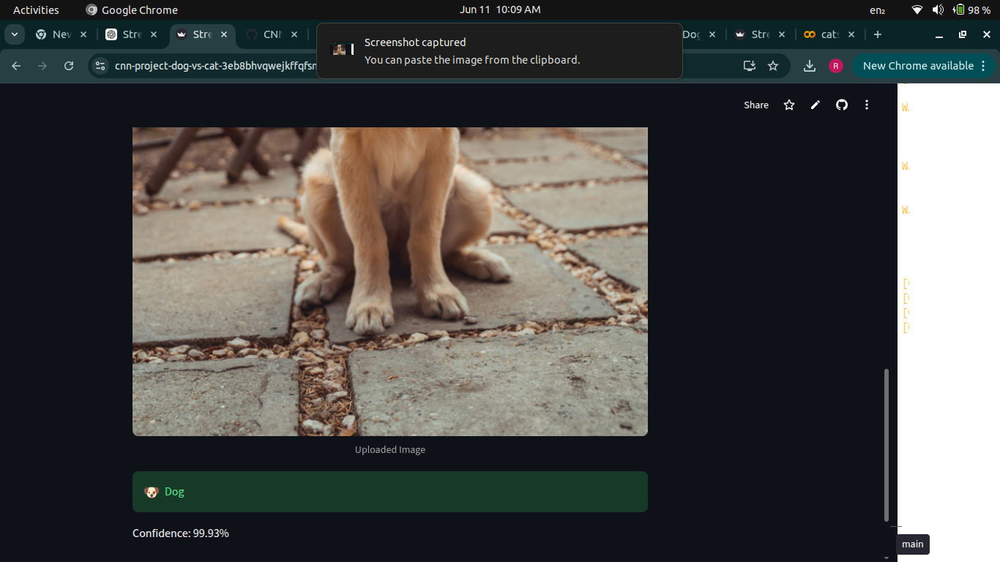

# CNN-project-dog-vs-cat
Description:

Developed a CNN-based image classification model using TensorFlow and Keras to identify whether an image contains a dog or a cat. The project includes dataset preprocessing, model training, validation, and real-time prediction on new images, demonstrating the application of deep learning in computer vision.

# 🐱 Cat vs 🐶 Dog Classifier

## Overview

This project uses a Convolutional Neural Network (CNN) built with TensorFlow and Keras to classify images as Cats or Dogs.

## Features

- Upload an image
- Predict Cat or Dog
- Display confidence score
- Streamlit web application

## Technologies Used

- Python
- TensorFlow
- Keras
- Streamlit
- NumPy
- Pillow

## Model Performance

- Training Accuracy: 87.68%
- Validation Accuracy: 85.82%

## Live Demo

https://cnn-project-dog-vs-cat-3eb8bhvqwejkffqfsnxrwv.streamlit.app/

## Project Workflow

1. Image preprocessing
2. CNN model training
3. Model evaluation
4. Model deployment using Streamlit
5. Real-time image prediction

## Author

Reniguntla Seenu

## 📸 Screenshots

### Home Page

### Cat Image

### Cat Prediction

### Dog Image

### Dog Prediction

